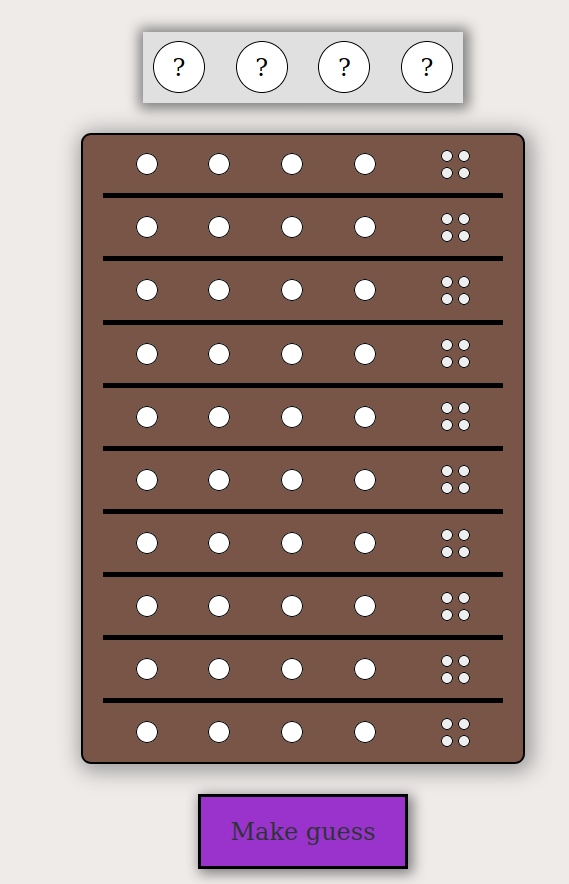

# Javascript Mastermind Game

> Written For Concordia University

<div align='center'>
  
</div><br>

## Demo

[View the Live Demo](https://andrewbaldwin44.github.io/JavaScript_Mastermind_Game/)

## Instructions

_Let's Play Mastermind!_

The computer is the mastermind! They have created a top secret code that you must crack. You are the code breaker. You must use wits and strategy to break the code! With each guess you make, hints are given as to how close your guess was! Your guess is made by placing four colored pegs on the board. The mastermind will then give you colored clues:

<span style='color: red; font-weight: bold'>A red clue:</span><br>
Each red clue means you have placed the correct color, and its in the correct position!

<span style='color: green; font-weight: bold'>A green clue:</span><br>
Each green clue means you have placed the correct color, but its not in the correct position! You have 10 turns to guess the code! If you guess the code before your time runs out, you win!


## How to Play

- Simply click on a blank peg to toggle the colors
- Once you are satisfied, click the `Make a Guess` button!
- The game is fully responsive. Enjoy on any screen!

## Deploy the project

__Clone the repo to your local machine using the terminal__:
```
$ git clone git@github.com:andrewbaldwin44/Javascript_Mastermind_Game.git
```

*Then Open the `index.html` Project File in Your Browser*

### Technologies Used:

- JavaScript
- HTML
- CSS

## Author

👤 **Andrew Baldwin**

- Github: [@andrewbaldwin44](https://github.com/andrewbaldwin44)
